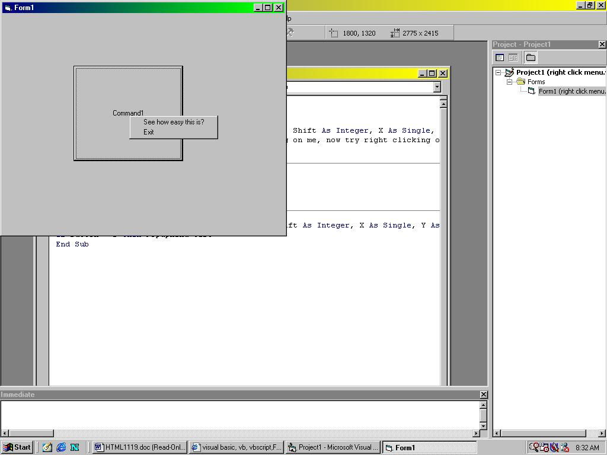



## Right Click Pop Up Menus, how to

### Description

This article discribes how to insert pop up menus. Both right and left click. As well as were the menu is displayed in relation to the mouse pointer
 
### More Info
 

             |
---                |---
**Submitted On**   |2001-11-19 08:29:02
**By**             |[Stephen Correll](https://github.com/Planet-Source-Code/PSCIndex/blob/master/ByAuthor/stephen-correll.md)
**Level**          |Beginner
**User Rating**    |5.0 (20 globes from 4 users)
**Compatibility**  |VB 6\.0
**Category**       |[Coding Standards](https://github.com/Planet-Source-Code/PSCIndex/blob/master/ByCategory/coding-standards__1-43.md)
**World**          |[Visual Basic](https://github.com/Planet-Source-Code/PSCIndex/blob/master/ByWorld/visual-basic.md)
**Archive File**   |[Right\_Clic3612211192001\.zip](https://github.com/Planet-Source-Code/stephen-correll-right-click-pop-up-menus-how-to__1-29013/archive/master.zip)

### Source Code

While making your program, go to the menu editor icon along the top of your screen, and create the desired menu. Click on the Visible check box, so that it is not checked. Go to your code screen. For this example I will just use the form for the object that the menu is associated with. You can do this for all objects. Go to the form and create the sub "Private Sub Form_MouseDown(Button As Integer, Shift As Integer, X As Single, Y As Single)" if you want the menu to pop up when you right click use the syntax "if button = 2 then popupmenu test" (where test is the name of your menu). If you want to have the menu displayed when the mouse is clicked, just take out the "if button = 2 then" If you would like the menu to show up everytime you right or left click insted of having to left click to exit it, use the code line "If Button = 2 Then PopupMenu test, 2" the 2 tells the computer were the pop up menu will be displayed in relation to the mouse pointer. For Example if you enter 100 the menu will display above the mouse, if you enter 200 it will be displayed to the left and down from the mouse. I hope this helps you, if it does please take a few seconds and post a review or some kind of feadback. (it is no fun to have 300+ hits and still be un-reviewed.)

